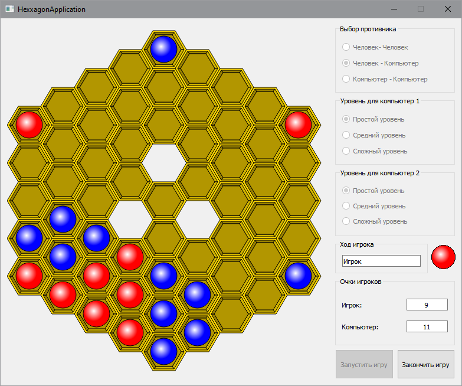

# Логическая игра "Гексагон" ("Hexxagon")
## Внешний вид приложения

## Правила игры
Игра «Гексагон» происходит на игровом поле, состоящем из шестиугольных ячеек. В начале игры на поле располагаются несколько фишек игроков разного цвета. Игроки поочередно выполняют ход своими фишками. Фишка может делать ход в соседние с ней свободные ячейки, при этом в свободную клетку добавляется новая фишка, а старая остается на своем месте, также фишка может быть переставлена на в одну из свободных ячеек, смежных с соседними ячейками, в результате такого хода новая фишка на игровое поле не добавляется. Все соседние фишки противника, расположенные рядом с ячейкой, в которую игрок выполняет ход, становятся фишками игрока и меняют свой цвет на соответствующий. Игра продолжается до тех пор, пока у одного из игроков не будет возможности сделать очередной ход. Победитель игры определяется по количеству фишек на игровом поле, игрок, чьих фишек окажется больше становится победителем.
